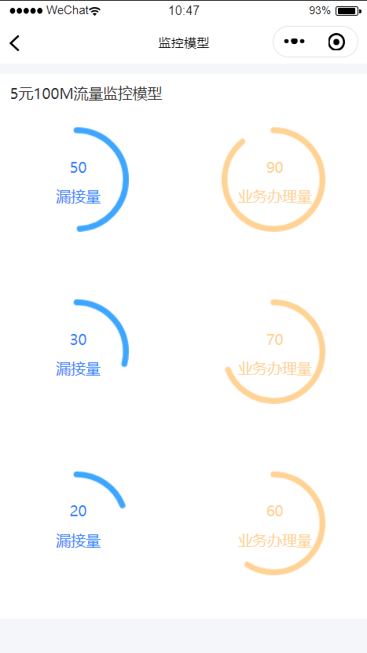
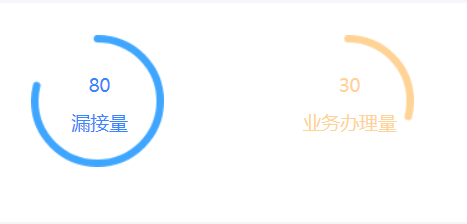
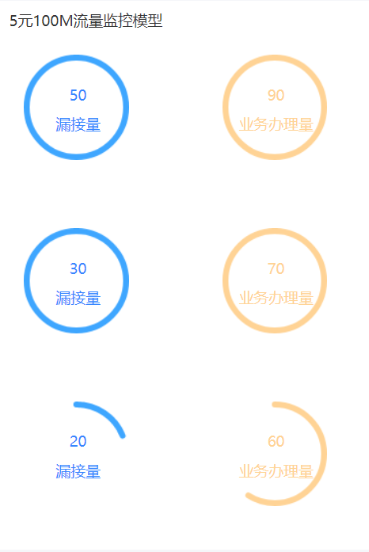
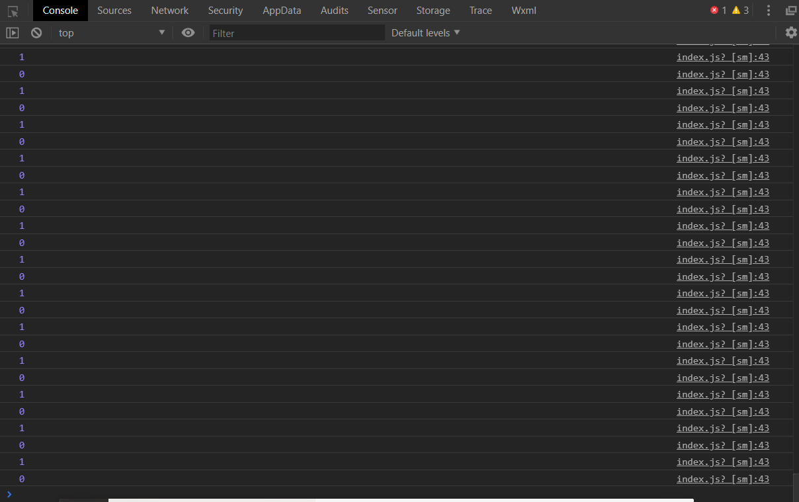

**需求：数据驱动图表渲染，先看效果图**



我们知道，微信小程序中是没有图表组件的，使用echarts也会有很多问题，比如echarts的图表总是在屏幕最上层，也就是说，会在导航栏和菜单栏上方，这当然不是我们想要的，所以只能自己画一个。由于小程序不支持svg，我就用canvas画了一个。  

**首先画一组图表，数据由data驱动**

- wxml部分

  ```wxml
   <view class="section flex">
     <view class='circleBar' bindtap="toModalDetail">
    <view class="wrap">
      <view class="top">
          <canvas class="cir" style=' width:106px; height:106px;' canvas-id="leak"></canvas>
          <view class="centerWord-num">{{resultComment}}</view>
          <view class="centerWord">漏接量</view>
      </view>
    </view>
  </view>
  <view class='circleBar'  bindtap="toModalDetail">
    <view class="wrap">
      <view class="top">
          <canvas class="cir" style=' width:106px; height:106px;' canvas-id="businessbanli"></canvas>
          <view class="centerWord-num-business">{{resultCommentbusiness}}</view>
          <view class="centerWord-business">业务办理量</view>
      </view>
    </view>
  </view>
  ```

- wxss部分

  ```wxss
  .circleBar {
    margin:50rpx;
    width: 250rpx;
    height: 250rpx;
    overflow: hidden;
    position: relative;
  }
   
  .cir {
    display: inline-block;
    background-color: #fff;
    border-radius: 100%;
  }
   
  .top {
    text-align: left;
  }
  .centerWord-num,.centerWord,.centerWord-num-business,.centerWord-business{
     width: 100%;
      position: absolute;
      left: -15rpx;
    text-align: center;
  }
  .centerWord-num{
    top: 30px;
    color: #3686ff;
  }
  .centerWord {
    top: 60px;
    color: #3686ff;
  }
  .centerWord-num-business{
    top: 30px;
    color: #FFD395;
  }
  .centerWord-business {
    top: 60px;
    color: #FFD395;
  }
  ```

- js部分

  ```javascript
  Page({
    data: {
      timer: '',
      timerbusiness:''
    },
    onLoad: function(options) {
      let that = this;
      // 以下两个是项目监控测试数据
      let totalItems = 100;
      let leakItems = 80;
      let businessItems=30;
      let completePercent = parseInt((leakItems / totalItems) * 100);
      let completePercentbusiness = parseInt((businessItems / totalItems) * 100);
      that.getResultComment(completePercent);
      that.getResultCommentbusiness(completePercentbusiness);
      that.showScoreAnimation(leakItems, totalItems);
      that.showScoreAnimationbusiness(businessItems, totalItems);
    },
   showScoreAnimation: function (leakItems, totalItems) {
      let that = this;
      let copyleakItems = 0;
      that.setData({
        timer: setInterval(function () {
          copyleakItems++;
          if (copyleakItems == leakItems) {
            clearInterval(that.data.timer)
          } else {
            // 页面渲染完成
            // 这部分是灰色底层
            let cxt_arc = wx.createCanvasContext('leak');//创建并返回绘图上下文context对象。
            cxt_arc.setLineWidth(6);//绘线的宽度
            cxt_arc.setStrokeStyle('#fff');//绘线的颜色
            cxt_arc.setLineCap('round');//线条端点样式
            cxt_arc.beginPath();//开始一个新的路径
            cxt_arc.arc(53, 53, 50, 0, 2 * Math.PI, false);//设置一个原点(53,53)，半径为50的圆的路径到当前路径
            cxt_arc.stroke();//对当前路径进行描边
            //这部分是蓝色部分
            cxt_arc.setLineWidth(6);
            cxt_arc.setStrokeStyle('#3ea6ff');
            cxt_arc.setLineCap('round')
            cxt_arc.beginPath();//开始一个新的路径
            cxt_arc.arc(53, 53, 50, -Math.PI * 1 / 2, 2 * Math.PI * (copyleakItems / totalItems) - Math.PI * 1 / 2, false);
            cxt_arc.stroke();//对当前路径进行描边
            cxt_arc.draw();
          }
        }, 20)
      })
    },
    showScoreAnimationbusiness: function (businessItems, totalItems) {
      let that = this;
      let copyleakItems = 0;
      that.setData({
        timerbusiness: setInterval(function () {
          copyleakItems++;
          if (copyleakItems == businessItems) {
            clearInterval(that.data.timerbusiness)
          } else {
            // 页面渲染完成
            // 这部分是灰色底层
            let cxt_arc = wx.createCanvasContext('businessbanli');//创建并返回绘图上下文context对象。
            cxt_arc.setLineWidth(6);//绘线的宽度
            cxt_arc.setStrokeStyle('#fff');//绘线的颜色
            cxt_arc.setLineCap('round');//线条端点样式
            cxt_arc.beginPath();//开始一个新的路径
            cxt_arc.arc(53, 53, 50, 0, 2 * Math.PI, false);//设置一个原点(53,53)，半径为50的圆的路径到当前路径
            cxt_arc.stroke();//对当前路径进行描边
            //这部分是蓝色部分
            cxt_arc.setLineWidth(6);
            cxt_arc.setStrokeStyle('#FFD395');
            cxt_arc.setLineCap('round')
            cxt_arc.beginPath();//开始一个新的路径
            cxt_arc.arc(53, 53, 50, -Math.PI * 1 / 2, 2 * Math.PI * (copyleakItems / totalItems) - Math.PI * 1 / 2, false);
            cxt_arc.stroke();//对当前路径进行描边
            cxt_arc.draw();
          }
        }, 20)
      })
    },
    getResultComment: function (completePercent) {
      let that = this;
      that.setData({
        resultComment: completePercent
      })
    },
    getResultCommentbusiness: function (completePercentbusiness) {
      let that = this;
      that.setData({
        resultCommentbusiness: completePercentbusiness
      })
    }
  });
  
  ```

  效果为：

  

  这样就能画出两个图表了，但是，我们需要以数据来决定图表的个数，确切来说是组数（两个为一组），假设有三组数据，暂且这样表示：

  ```
  data: {
      timer: '',
      timerbusiness: '',
      modalNum:[
        { leak: 50, business: 90 },
        { leak: 30, business: 70 },
        { leak: 20, business: 60 }
      ]
    },
  ```

  我们需要按照这组数据循环渲染，很简单，外面包上一层block再用wx:for就可以了

  ```wxml
  <view class="section">
    <view class="text">5元100M流量监控模型</view>
    <block wx:for="{{modalNum}}" wx:key="{{index}}">
      <view class="flex" data-index="{{index}}">
        <view class='circleBar'  bindtap="toModalDetail">
          <view class="wrap">
            <view class="top">
              <canvas class="cir" style=' width:106px; height:106px;' canvas-id="leak-{{index}}"></canvas>
              <view class="centerWord-num">{{item.leak}}</view>
              <view class="centerWord">漏接量</view>
            </view>
          </view>
        </view>
        <view class='circleBar'  bindtap="toModalDetail">
          <view class="wrap">
            <view class="top">
              <canvas class="cir" style=' width:106px; height:106px;' canvas-id="business-{{index}}"></canvas>
              <view class="centerWord-num-business">{{item.business}}</view>
              <view class="centerWord-business">业务办理量</view>
            </view>
          </view>
        </view>
      </view>
    </block>
  </view>
  ```

  因为每个canvas需要有独立的id，所以给每个id后面都加上了当前的index。js部分也循环一遍：

  ```javascript
  onLoad: function (options) {
      let that = this;
      this.data.modalNum.map((value,index)=>{
        let totalItems = 100;
        let leakItems = value.leak;
        let businessItems = value.business;
        that.showScoreAnimation(leakItems, totalItems,index);
        that.showScoreAnimationbusiness(businessItems, totalItems,index);
      })
    },
    showScoreAnimation: function (leakItems, totalItems,index) {
      let that = this;
      let copyleakItems = 0;
      that.setData({
        timer: setInterval(function () {
          copyleakItems++;
          if (copyleakItems == leakItems) {
            clearInterval(that.data.timer)
          } else {
            // 页面渲染完成
            // 这部分是白色底层
            let cxt_arc = wx.createCanvasContext("leak-"+index);//创建并返回绘图上下文context对象。
            cxt_arc.setLineWidth(6);//绘线的宽度
            cxt_arc.setStrokeStyle('#fff');//绘线的颜色
            cxt_arc.setLineCap('round');//线条端点样式
            cxt_arc.beginPath();//开始一个新的路径
            cxt_arc.arc(53, 53, 50, 0, 2 * Math.PI, false);//设置一个原点(53,53)，半径为50的圆的路径到当前路径
            cxt_arc.stroke();//对当前路径进行描边
            //这部分是蓝色部分
            cxt_arc.setLineWidth(6);
            cxt_arc.setStrokeStyle('#3ea6ff');
            cxt_arc.setLineCap('round')
            cxt_arc.beginPath();
            cxt_arc.arc(53, 53, 50, -Math.PI * 1 / 2, 2 * Math.PI * (copyleakItems / totalItems) - Math.PI * 1 / 2, false);
            cxt_arc.stroke();
            cxt_arc.draw();
          }
        }, 20)
      })
    },
    showScoreAnimationbusiness: function (businessItems, totalItems,index) {
      let that = this;
      let copyleakItems = 0;
      that.setData({
        timerbusiness: setInterval(function () {
          copyleakItems++;
          if (copyleakItems == businessItems) {
            clearInterval(that.data.timerbusiness)
          } else {
            // 页面渲染完成
            // 这部分是白色底层
            let cxt_arc = wx.createCanvasContext("business-"+index);//创建并返回绘图上下文context对象。
            cxt_arc.setLineWidth(6);//绘线的宽度
            cxt_arc.setStrokeStyle('#fff');//绘线的颜色
            cxt_arc.setLineCap('round');//线条端点样式
            cxt_arc.beginPath();//开始一个新的路径
            cxt_arc.arc(53, 53, 50, 0, 2 * Math.PI, false);//设置一个原点(53,53)，半径为50的圆的路径到当前路径
            cxt_arc.stroke();//对当前路径进行描边
            //这部分是橙色部分
            cxt_arc.setLineWidth(6);
            cxt_arc.setStrokeStyle('#FFD395');
            cxt_arc.setLineCap('round')
            cxt_arc.beginPath();//开始一个新的路径
            cxt_arc.arc(53, 53, 50, -Math.PI * 1 / 2, 2 * Math.PI * (copyleakItems / totalItems) - Math.PI * 1 / 2, false);
            cxt_arc.stroke();//对当前路径进行描边
            cxt_arc.draw();
          }
        }, 20)
      })
    }
  ```

  显然，这样做有一个很大的问题，每一组数据用的都是同一个定时器，这样会导致混乱，只能关闭最后一个定时器，如下图：

  

  控制台打印index值：

  

  前两组数据无法关闭定时器而陷入死循环，copyleakItems的值不断增大却始终无法结束。所以我们需要给每一个canvas一个单独的定时器：

  ```javascript
  onLoad: function (options) {
      let that = this;
      this.data.modalNum.map((value,index)=>{
        let totalItems = 100;
        let leakItems = value.leak;
        let businessItems = value.business;
        that.showScoreAnimation(leakItems, totalItems,index);
        that.showScoreAnimationbusiness(businessItems, totalItems,index);
      })
        
    },
    showScoreAnimation: function (leakItems, totalItems,index) {
      let that = this;
      let copyleakItems = 0;
      let itemData = "timer"+index;
      that.setData({
        [itemData]: setInterval(function () {
          copyleakItems++;
          if (copyleakItems == leakItems) {
            clearInterval(that.data[itemData])
          } else {
            // 页面渲染完成
            // 这部分是白色底层
            let cxt_arc = wx.createCanvasContext("leak-"+index);//创建并返回绘图上下文context对象。
            cxt_arc.setLineWidth(6);//绘线的宽度
            cxt_arc.setStrokeStyle('#fff');//绘线的颜色
            cxt_arc.setLineCap('round');//线条端点样式
            cxt_arc.beginPath();//开始一个新的路径
            cxt_arc.arc(53, 53, 50, 0, 2 * Math.PI, false);//设置一个原点(53,53)，半径为50的圆的路径到当前路径
            cxt_arc.stroke();//对当前路径进行描边
            //这部分是蓝色部分
            cxt_arc.setLineWidth(6);
            cxt_arc.setStrokeStyle('#3ea6ff');
            cxt_arc.setLineCap('round')
            cxt_arc.beginPath();
            cxt_arc.arc(53, 53, 50, -Math.PI * 1 / 2, 2 * Math.PI * (copyleakItems / totalItems) - Math.PI * 1 / 2, false);
            cxt_arc.stroke();
            cxt_arc.draw();
          }
        }, 20)
      })
    },
    showScoreAnimationbusiness: function (businessItems, totalItems,index) {
      let that = this;
      let copyleakItems = 0;
      let itemData = "timerbusiness" + index;
      that.setData({
        [itemData]: setInterval(function () {
          copyleakItems++;
          if (copyleakItems == businessItems) {
            clearInterval(that.data[itemData])
          } else {
            // 页面渲染完成
            // 这部分是白色底层
            let cxt_arc = wx.createCanvasContext("business-"+index);//创建并返回绘图上下文context对象。
            cxt_arc.setLineWidth(6);//绘线的宽度
            cxt_arc.setStrokeStyle('#fff');//绘线的颜色
            cxt_arc.setLineCap('round');//线条端点样式
            cxt_arc.beginPath();//开始一个新的路径
            cxt_arc.arc(53, 53, 50, 0, 2 * Math.PI, false);//设置一个原点(53,53)，半径为50的圆的路径到当前路径
            cxt_arc.stroke();//对当前路径进行描边
            //这部分是橙色部分
            cxt_arc.setLineWidth(6);
            cxt_arc.setStrokeStyle('#FFD395');
            cxt_arc.setLineCap('round')
            cxt_arc.beginPath();//开始一个新的路径
            cxt_arc.arc(53, 53, 50, -Math.PI * 1 / 2, 2 * Math.PI * (copyleakItems / totalItems) - Math.PI * 1 / 2, false);
            cxt_arc.stroke();//对当前路径进行描边
            cxt_arc.draw();
          }
        }, 20)
      })
    }
  ```

  这样就可以用数据渲染多个canvas了
