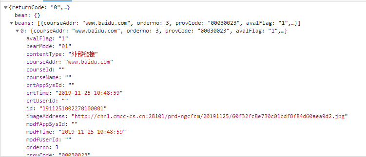

### 链接跳转出现404问题&//代替http://和https://

在亚信渠道外呼项目组工作的时候负责轮播图管理这一块的内容，需要在轮播管理页面上传图片和一个链接，在首页点击这张轮播图的时候跳转到这个链接


存储的时候将用户输入的链接完整的保存到courseAddr这个字段中



但是在跳转的时候就会自动加上当前页面的前缀


**解决的办法是：输入完整的地址https://www.baidu.com**  

这是因为，当跳转地址填写不完整时，浏览器会认为是在当前页面下跳转改地址，就会在地址前面加上当前页面的域名或者部分地址，而当地址填写完整时，就会直接跳转  

在这个项目中，可以判断用户输入的地址是否为完整地址，如果不是完整地址，就提醒用户将地址写完整，但是用户或许更希望系统能自动将地址补全。**然而，我们并不知道用户输入的地址是http协议还是https协议**，系统自动补全协议这种办法似乎不好实现。

**我们可以用“//”来代替“http://”或"https://"**  

//是缺省协议的写法，例如：

```
//www.baidu.com
```

缺省协议默认使用当前协议

当前页面为HTTP时，等效

```
http://www.baidu.com
```

当前页面为HTTPS时，等效

```
https://www.baidu.com
```

**这样我们就只需要判断用户输入的地址中是否含有“http”或者“//”，如果不含，就给这个地址加上“//”**

**使用 // 代替 http:// 和https://的条件和好处？**

当前页面和目标资源同时支持HTTP和HTTPS正在从http升级到https

这样的好处就是能根据用户打开页面的方式自适应的选择资源的请求协议,

对于https页面的内容，浏览器默认会组织非https内容，可以避免这种情况

**缺点：**

直接打开本地文件调试时，使用的协议是文件协议(file://)

这个时候这个协议会变成 file://www.baidu.com显然是不存在的

与当前网站的协议保持一致，快速发布与你当前协议相匹配的版本，同时减少SSL或其它协议版本的部署成本。开发者不需要管服务器云端提供什么协议，只要用//符号来代表一切最适应的匹配，这和nodeJS的思维是一脉相承的。

**优点：**

因为很多网站都将http升级为https，这样就可以防止我们的网址被劫持，前期为了在转换过程中我出差错我们没有强制跳转,就是当用户访问http或https都可以正常访问，那么里面的js，图片，链接等都不能用https或http，那么有什么解决方法呢，那么解决方法来了就是用//，不要带http:与https这样就可以了。

//这种写法是根据你请求的协议自动添加协议的。举个栗子：你的网站是http协议，那么其实你访问的就是http://xxxx 如果你的网站是https协议的，那么请求的地址会变成https://xxxx 要知道，如果你写成了http://xxx. 那么如果你们的网站线上是https，那么可能会报安全警告，有的浏览器甚至没法正常加载页面。如果你直接写成https，要知道，本地开发可是http啊...


补充一个为什么前人不这么写的理由。当然，确实有很多前端并不知道这种写法。不过，就算知道也很可能无法这么写。因为 UC 浏览器的许多较早版本不支持这种写法，会把 //a.b/ 直接理解为 /a.b/，也就是说，如果你在 http://example.com 的页面里写了 //example-cdn.net/static-file 的地址，UC 实际访问的是 http://example.com/example-cdn.net/static-file 。UC 过去的市占率很高的。

 